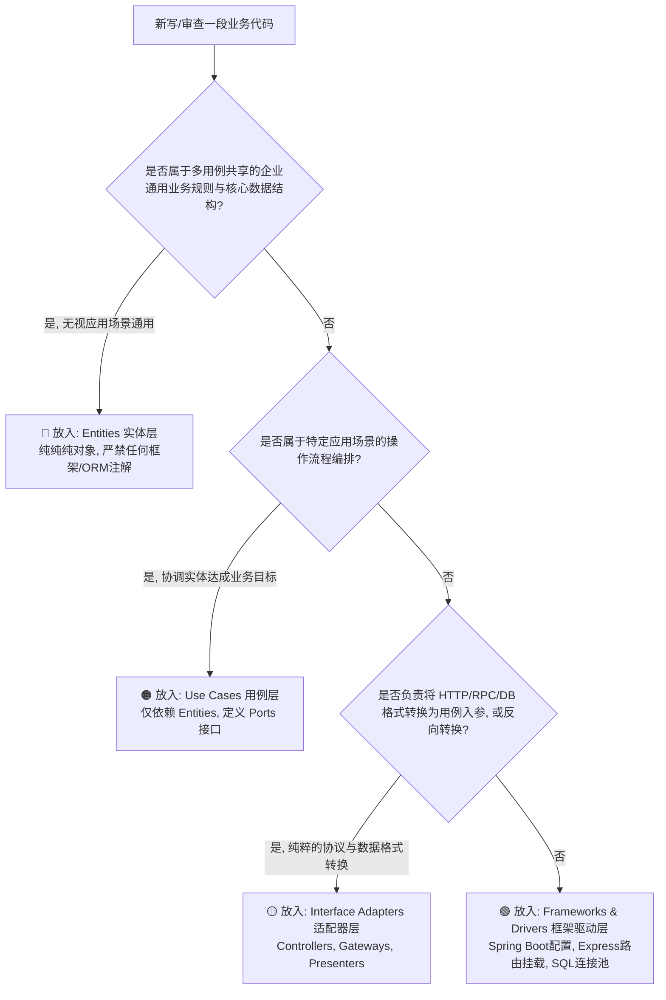

# 依赖关系原则与经典同心圆四层架构 (The Dependency Rule & Concentric Layers)

> 选自 Robert C. Martin (Uncle Bob)《架构整洁之道》(Clean Architecture) 核心心智模型提炼。

---

## 1. 核心概念与定义

- **依赖关系原则（The Dependency Rule）—— 架构的第一铁律**：  
  **“源码依赖方向必须永远且只能指向更高层次的策略（由外圆指向内圆）。”**  
  在内圆的代码绝不能知晓外圆的任何名称、函数、类、变量或格式。外圆机制变动时，内圆策略应岿然不动。
- **同心圆四层模型（Concentric Rings）**：
  1. **实体层（Entities / Enterprise Business Rules - 最内层）**：  
     封装全企业最核心的关键业务数据与业务规则（Critical Business Rules）。必须是纯粹的对象（POJO/Vanilla Class），不包含任何与特定框架、数据库或传输协议相关的代码。
  2. **用例层（Use Cases / Application Business Rules - 次内层）**：  
     封装特定应用的业务流程。负责编排实体间的数据流转，指挥实体应用其业务规则以达成用例意图。定义**输入端口（Input Boundary）**与**输出端口（Output Boundary）**。
  3. **接口适配器层（Interface Adapters - 次外层）**：  
     负责将用例和实体方便操作的数据格式，与外部机构（数据库、Web、UI）方便操作的格式进行**双向转换**。包含控制器（Controllers）、门面/网关实现（Gateways）、展示器（Presenters）。
  4. **框架与驱动层（Frameworks & Drivers - 最外层）**：  
     由所有的工具、数据库、Web 框架、UI 渲染引擎、消息队列等构成。这一层基本上只写少量的粘合胶水代码（Glue Code），它们随时可以被替换。

---

## 2. 决策指南：分层归属决策树与依赖流动矩阵 (Decision Tree)

### (1) 代码分层归属决策树



### (2) 依赖流动矩阵 (Dependency Matrix)

| 所在层级 | 可以依赖谁？ (Allow Import) | 绝对禁止依赖谁？ (Deny Import) | 违反后果 |
| :--- | :--- | :--- | :--- |
| **Entities (实体)** | 仅依赖标准语言库或同层实体 | ❌ Use Cases, Controllers, ORM/DB, Web框架 | 核心业务模型被具体应用流程或技术框架绑架 |
| **Use Cases (用例)** | ✅ Entities, 标准语言库, 自己定义的 Ports 接口 | ❌ Controllers, Repositories实现类, Spring/Express, SQL驱动 | 用例无法独立进行单元测试，业务逻辑受外层污染 |
| **Interface Adapters** | ✅ Use Cases (通过 Input Port), Entities, Ports接口 | ❌ 具体的外部框架底层实现（应依赖抽象驱动） | 适配器无法独立更换传输通道 |
| **Frameworks & Drivers** | ✅ 全部内层（通过装配调用） | 理论上拥有全局可见性，但只充当运行时装配者 | 若反过来让内层依赖自己，导致架构全面腐化 |

---

## 3. 反模式与坏味道 (Anti-patterns)

- **逆向依赖（Inward Leakage / Upward Dependency）**：  
  *错误做法*：在 Use Case 中为了方便，直接 `import express.Request` 或 `import org.springframework.http.ResponseEntity`。  
  *危害后果*：业务用例与特定 Web 框架死死绑定，无法在 CLI、后台定时任务或 RPC 服务中复用，无法进行纯内存高速单测。
- **实体直接沦为数据库表（Entity-Table Conflation）**：  
  *错误做法*：把 Entities 层的类直接加上 `@Table(name = "t_order")`、`@Column`，甚至是 TypeORM / Mongoose 的 Model。  
  *危害后果*：数据库字段的变动直接强迫核心领域逻辑重新编译和测试；关系型数据库的范式约束反客为主绑架了领域设计。
- **贫血直穿（Anemic Bypassing）**：  
  *错误做法*：Controller 拿到前端请求后，直接绕过 Use Case 和 Entity，调用 DAO/Mapper 并在 Controller 里写了 500 行拼接 SQL 与字典转换。  
  *危害后果*：三层架构沦为名存实亡的摆设，业务逻辑彻底外泄，整个系统退化为面向数据库的增删改查胶水代码。

---

## 4. Do & Don't 对比

### 案例 1：依赖倒置（DIP）打破内层对外层的依赖

- ❌ **Don't（用例层直接依赖持久化具体类与数据库细节）**：
  ```typescript
  // 位于 use-cases/CreateOrderUseCase.ts
  // 致命错误：内层 UseCase 依赖了外层的 MySQLOrderRepository 具体实现！
  import { MySQLOrderRepository } from '../frameworks/database/MySQLOrderRepository';

  export class CreateOrderUseCase {
    private repo = new MySQLOrderRepository(); // 强耦合，无法脱离真实 MySQL 运行测试

    execute(orderData: any) {
      // 业务逻辑...
      this.repo.saveToDatabase(orderData);
    }
  }
  ```
- ✅ **Do（用例层定义抽象端口 Output Port，外层适配器实现该端口）**：
  ```typescript
  // 1. 位于 use-cases/ports/OrderRepositoryPort.ts (用例层自身定义的输出端口)
  export interface OrderRepositoryPort {
    save(order: Order): Promise<void>;
    findById(id: string): Promise<Order | null>;
  }

  // 2. 位于 use-cases/CreateOrderUseCase.ts (纯业务编排，只面向抽象)
  export class CreateOrderUseCase {
    // 依赖注入端口接口，源码依赖方向单向朝内
    constructor(private readonly orderRepo: OrderRepositoryPort) {}

    async execute(request: CreateOrderRequestModel): Promise<void> {
      const order = Order.create(request.customerId, request.items);
      await this.orderRepo.save(order);
    }
  }

  // 3. 位于 interface-adapters/gateways/MySQLOrderRepository.ts (外层实现接口)
  import { OrderRepositoryPort } from '../../use-cases/ports/OrderRepositoryPort';

  export class MySQLOrderRepository implements OrderRepositoryPort {
    async save(order: Order): Promise<void> {
      // 在最外层适配器处理 SQL 语句与字段映射
    }
    async findById(id: string): Promise<Order | null> { ... }
  }
  ```
