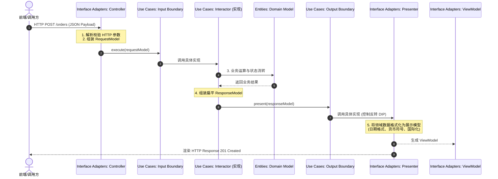
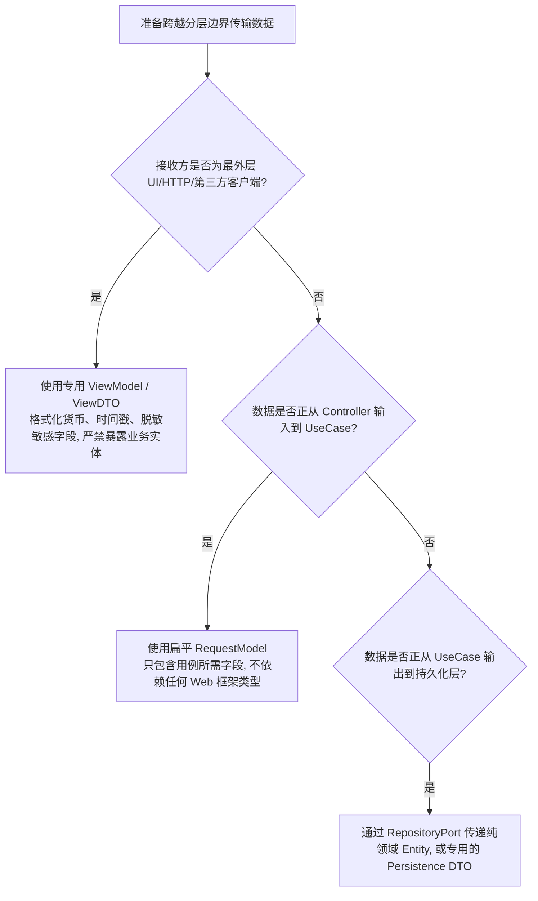

# 边界划界与跨边界数据传输规约 (Boundaries & Data Crossing)

> 深入解读 Uncle Bob《架构整洁之道》中关于架构边界、端口（Ports）与跨边界数据载体的设计要求。

---

## 1. 核心概念与定义

- **架构边界（Architectural Boundaries）**：  
  在软件系统内部人为画出的一道道隔离线，目的是将系统分割成互不干扰、独立可编译、独立可测试的组件。边界的最重要职责是：**阻止一边因变更而对另一边造成破坏**。
- **端口体系（Ports）**：
  - **输入端口（Input Port / Input Boundary）**：用例暴露给外界的操作接口（如 `OrderCreationInputBoundary`），Controller 调用它。
  - **输出端口（Output Port / Output Boundary）**：用例要求外界提供的服务接口（如 `OrderRepositoryPort`、`OrderPresenterOutputBoundary`），由 Gateway 或 Presenter 实现。
- **跨边界数据载体（Crossing Data Structures）**：  
  跨越边界传递的数据必须是**简单的、扁平的数据结构（Plain Old Data / DTO）**：
  - **Request Model**：由 Controller 将 HTTP/RPC 请求参数清洗后组装成的扁平对象，传递给用例。
  - **Response Model**：用例执行完毕后产出的纯数据载体，传递给 Presenter。
  - **铁律**：**严禁将 Entities 实体作为跨边界的数据载体直接传递给外部世界（如 UI、Web 响应）**。

---

## 2. 决策指南：跨边界数据流转与控制流解耦 (Decision Tree)

### (1) 完整跨边界数据流闭环 (Canonical Flow)



### (2) 跨边界数据对象选型决策树



---

## 3. 反模式与坏味道 (Anti-patterns)

- **实体直接裸奔暴露（Entity Naked Exposure）**：  
  *错误做法*：在 Spring / Express Controller 里直接将领域模型 `UserEntity` 或 `AccountEntity` 作为 JSON 序列化输出给前端。  
  *危害后果*：用户的密码哈希、内部审计字段（`version`、`deleted_at`）随之泄露；前端迫使后端在实体上加 `@JsonIgnore`，导致领域实体被序列化细节反向污染。
- **全局万能 DTO（The God DTO）**：  
  *错误做法*：设计一个 `OrderDTO`，从前端表单提交、到用例入参、到数据库表映射全程复用同一个类。  
  *危害后果*：跨越了 3 道边界却没有任何隔离，前端修改一个显示字段将引发用例层与持久层的连锁报错，边界彻底形同虚设。
- **Presenter 职责侵入用例（Formatting in Use Case）**：  
  *错误做法*：在 Use Case 内部拼接千分位金额字符串 `"¥ 1,234.50"` 或执行多语言文案翻译。  
  *危害后果*：用例被表现层格式细节污染，无法适配不同的客户端展示要求。

---

## 4. Do & Don't 对比

### 案例：Controller 与 Presenter 跨边界协作

- ❌ **Don't（Controller 身兼数职，直接将 Entity 返回）**：
  ```typescript
  // 位于 controllers/OrderController.ts
  export class OrderController {
    async handleCreate(req: Request, res: Response) {
      // 没有任何 Input/Output Boundary 隔离
      const order = await this.orderService.create(req.body); 
      // 致命错误：直接把内部实体 order 序列化返还，且在 Controller 中掺杂展示逻辑
      res.json({
        id: order.id,
        moneyStr: `¥${order.price.toFixed(2)}`, // 格式化泄露在控制器中
        secretToken: order.internalHash // 严重隐患：敏感字段意外泄露
      });
    }
  }
  ```
- ✅ **Do（输入/输出端口严格解耦，RequestModel 与 ViewModel 隔离）**：
  ```typescript
  // 1. 扁平入参 RequestModel 与 输入端口
  export interface CreateOrderRequest {
    readonly customerId: string;
    readonly totalAmountCents: number;
  }
  export interface CreateOrderInputPort {
    execute(request: CreateOrderRequest): Promise<void>;
  }

  // 2. 扁平出参 ResponseModel 与 输出端口
  export interface CreateOrderResponse {
    readonly orderId: string;
    readonly totalAmountCents: number;
    readonly status: string;
  }
  export interface CreateOrderOutputPort {
    presentSuccess(response: CreateOrderResponse): void;
    presentFail(error: Error): void;
  }

  // 3. Controller 只管解析输入并调度用例
  export class OrderController {
    constructor(private readonly useCase: CreateOrderInputPort) {}

    async handle(req: HttpRequest): Promise<void> {
      const requestModel: CreateOrderRequest = {
        customerId: req.body.userId,
        totalAmountCents: Math.round(Number(req.body.amount) * 100)
      };
      await this.useCase.execute(requestModel);
    }
  }

  // 4. Presenter 专门负责将 ResponseModel 转为适配前端的 ViewModel
  export class OrderWebPresenter implements CreateOrderOutputPort {
    public viewModel: any;

    presentSuccess(res: CreateOrderResponse): void {
      this.viewModel = {
        success: true,
        orderNo: res.orderId,
        displayPrice: `¥ ${(res.totalAmountCents / 100).toFixed(2)}`, // 格式化归位在 Presenter
        statusLabel: res.status === 'PAID' ? '已支付' : '待处理'
      };
    }
    presentFail(error: Error): void {
      this.viewModel = { success: false, message: error.message };
    }
  }
  ```
