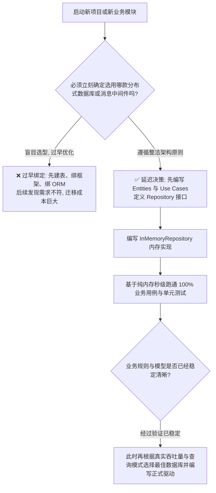

# 高层策略与细节即插件法则 (Policy vs Details as Plugins)

> 深入解读 Uncle Bob《架构整洁之道》中关于“策略高于细节”、“数据库是细节”、“Web 是细节”与“装配根”的哲学实践。

---

## 1. 核心概念与定义

- **高层策略（High-Level Policy）**：  
  系统中所有与核心业务意图、计算规则、状态机流转直接相关的决策。高层策略是系统的核心价值所在，其变更节奏取决于业务自身，而与其他技术选型无关。
- **细节（Details）**：  
  为了让高层策略能够运行在物理机器上所采用的辅助技术：
  - **数据库是细节（Database is a Detail）**：数据持久化机制只是一种获取与保存数据的机制，领域核心不应关心数据存放在 MySQL、PostgreSQL、MongoDB 还是内存映射文件中。
  - **Web 是细节（Web is a Detail）**：HTTP、REST、GraphQL、gRPC 只是交付机制（Delivery Mechanism），只负责将外部输入送达系统。业务不应该知晓自己是被 Web 访问还是被 CLI 命令行调用。
  - **框架是细节（Frameworks are Details）**：框架作者并不知道你的业务痛点。过度将业务代码继承框架基类，等同于与第三方供应商签订了“终身单向绑架契约”。
- **系统装配根（The Main Component / Composition Root）**：  
  在整个整洁架构中，**唯一被允许感知全局所有组件细节的代码**。它是“最脏”但也最必要的胶水模块，负责读取配置文件、实例化各种数据库驱动与 Web 路由器，并将它们通过依赖注入（DI）组装给内层用例。

---

## 2. 决策指南：细节即插件与延迟决策矩阵 (Decision Matrix)

### (1) 框架与业务核心的“婚姻与恋爱”法则

| 维度 | ❌ 框架绑架模式 (Framework Kidnapping) | ✅ 细节即插件模式 (Details as Plugins) |
| :--- | :--- | :--- |
| **继承关系** | 业务实体继承框架基类（如 `class Order extends Model`） | 业务实体为纯纯纯语言对象（POJO / Plain Class） |
| **注解侵入** | 核心实体上充斥 `@Table`, `@Entity`, `@Column`, `@BsonProperty` | 实体无持久化注解；若有持久化映射，在适配器层单独建立 ORM Schema |
| **依赖方向** | 业务代码到处直接 `import` Web 框架的上下文或工具类 | 业务代码零框架依赖，框架通过实现业务定义的接口“插入”系统 |
| **升级与替换成本** | 框架发布大版本 Breaking Changes，导致整个业务层重写 | 框架升级仅影响外层几千行胶水代码，业务内核完全不受波及 |

### (2) 延迟技术决策树 (Deferring Decisions)



---

## 3. 反模式与坏味道 (Anti-patterns)

- **框架基类感染（Base Class Infection）**：  
  *典型症状*：为了少写两行代码，让业务领域对象继承了特定 ORM 框架的基类（如 Active Record 或 Django Models）。  
  *致命后果*：任何单元测试都必须启动数据库或打大量底层桩，单测耗时从 10 毫秒飙升到几分钟；当未来想换数据库或分库分表时，重构无从下手。
- **业务逻辑下沉进存储过程（Logic in Database）**：  
  *典型症状*：大量的价格计算、优惠券判定、状态扭转写在 MySQL 存储过程或数据库触发器里。  
  *致命后果*：数据库从“可替换的数据载体”变成了不可迁移的性能单点与黑盒黑洞，版本控制与自动化测试难以介入。
- **无处不在的硬编码初始化（Sprawling Construction）**：  
  *典型症状*：在业务代码的各个类中随手 `new RedisClient()` 或从单例工厂直接拉取数据库句柄。  
  *正确解法*：**必须集中在 Composition Root（装配根）进行依赖注入**，业务类只被动接收依赖，绝不自行初始化外部服务。

---

## 4. Do & Don't 对比

### 案例 1：纯领域模型 vs 框架注解大杂烩

- ❌ **Don't（一个类同时兼任业务实体、JPA Entity 和 JSON DTO）**：
  ```java
  // 位于 domain/Order.java
  // 灾难：领域模型被数据库、JSON 框架全部绑架
  @Entity
  @Table(name = "t_orders")
  public class Order {
      @Id
      @GeneratedValue(strategy = GenerationType.IDENTITY)
      private Long id;

      @Column(name = "order_no", nullable = false)
      @JsonProperty("order_sn") // 掺杂前端序列化名称
      private String orderNo;

      @Transient
      private Long tempUserId; // 临时字段

      // 业务计算与 JPA 生命周期回调深度纠缠
      @PrePersist
      public void onSave() { ... }
  }
  ```
- ✅ **Do（核心领域模型保持纯净，外层适配器使用独立 ORM 实体映射）**：
  ```typescript
  // 1. 位于 entities/Order.ts (纯纯纯领域实体，零第三方导入)
  export class Order {
    constructor(
      private readonly id: string,
      private readonly customerId: string,
      private amount: Money
    ) {}

    // 纯业务计算逻辑
    applyDiscount(discount: Discount): void {
      this.amount = this.amount.subtract(discount.calculate(this.amount));
    }
    get total(): Money { return this.amount; }
  }

  // 2. 位于 interface-adapters/gateways/orm/OrderOrmEntity.ts (最外层数据库专用映射)
  @Entity('orders')
  export class OrderOrmEntity {
    @PrimaryColumn() id!: string;
    @Column() customer_id!: string;
    @Column('decimal') amount_cents!: number;

    // 适配器负责双向映射：ORM 实体 <-> 纯领域实体
    static toDomain(orm: OrderOrmEntity): Order { ... }
    static fromDomain(order: Order): OrderOrmEntity { ... }
  }
  ```

### 案例 2：Composition Root 集中装配

- ❌ **Don't（业务用例内部自行初始化外部依赖）**：
  ```typescript
  export class CheckoutUseCase {
    private paymentClient = new StripePaymentClient(process.env.STRIPE_KEY!); // 无法隔离测试
  }
  ```
- ✅ **Do（在 Main 入口统一组装，内层通过构造函数被动注入）**：
  ```typescript
  // 位于 main/server.ts (Composition Root)
  // 这是系统唯一允许连接全部组件的入口
  const dbConnection = createDatabasePool(config.databaseUrl);
  const orderRepo = new PostgresOrderRepository(dbConnection);
  const paymentGateway = new StripePaymentGateway(config.stripeApiKey);

  // 将依赖注入用例
  const checkoutUseCase = new CheckoutUseCase(orderRepo, paymentGateway);

  // 挂载到 HTTP 控制器
  const controller = new CheckoutController(checkoutUseCase);
  app.post('/api/checkout', (req, res) => controller.handle(req, res));
  ```
