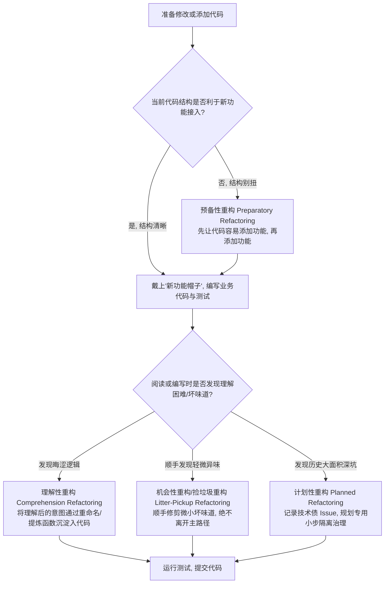

# 重构哲学、节奏控制与测试防护网 (Principles & Rhythm)

> 选自 Martin Fowler《重构：改善既有代码的设计》（第 2 版）核心心智模型提炼。

---

## 1. 核心概念与定义

- **重构的严格定义（Refactoring）**：  
  在**不改变软件可观察外部行为**的前提下，改善其内部结构，以提高其可理解性并降低其未来的修改成本。任何改变功能表现、输入输出接口或增加新业务特性的行为，均**不属于**重构。
- **两顶帽子法则（Two Hats）**：  
  在软件开发中，开发者必须时刻清晰意识到自己当前戴着哪顶帽子：
  - **添加新功能（Adding Feature）**：只增加新功能与测试，不修改既有代码结构，追求功能上线。
  - **重构（Refactoring）**：只重组既有代码结构，不改变可观察行为，不增加新功能，只在发现测试缺失时补充测试。
  - **铁律**：严禁在一次提交或同一时间段混戴两顶帽子。
- **重构节奏（The Rhythm of Refactoring）**：  
  重构不是一次性的“浩大工程”，而应遵循**小步快跑（Micro-steps）**：重构一小步 → 运行测试验证绿灯 → 提交版本 → 继续下一小步。每一步若出错，可在 10 秒内撤销回上一个绿灯状态。
- **测试防护网（Self-Testing Code）**：  
  没有可靠的自动化测试套件支撑的“重构”，实质上是在**盲目修改代码并引入未可知 Bug**。测试套件是安全重构的不可妥协的前提。

---

## 2. 决策指南：重构决策树 (Decision Tree)

### (1) 何时重构？何时重写？

| 判定维度 | 方案 A：小步重构 (Refactor) | 方案 B：彻底重写 (Rewrite) |
| :--- | :--- | :--- |
| **代码运行状态** | 代码当前在生产环境稳定运行，有业务价值，但难以添加新特性 | 代码极其残破，Bug 频发，甚至无法在现代环境正常编译/启动 |
| **测试完备度** | 具备部分自动化测试，或能够较容易地补齐端到端/契约测试防护网 | 毫无测试，且强耦合到过时不可用的第三方库，写测试的成本高于重写 |
| **接口契约** | 外部调用接口相对稳定，内部逻辑晦涩、分支复杂 | 外部契约已彻底不适应新架构，底层协议或领域抽象需要彻底颠覆 |
| **成本预估** | 采用微步骤能在数小时~数天内持续交付健康度净增 | 重构成本经评估明显高于重新开发一套全新干净组件并做灰度切换 |

### (2) 重构时机四维决策



---

## 3. 反模式与坏味道 (Anti-patterns)

- **混合提交（Feature-Refactor Blend）**：  
  *错误做法*：在同一个 Pull Request 或 Git 提交里既写了新的业务需求，又顺便把周边类重构了一遍。  
  *危害后果*：PR 膨胀至几千行，Reviewer 无法区分哪行改动是新功能哪行是重构；一旦线上发生 Regression，`git revert` 或 `git bisect` 无法精确定位与回滚。
- **无测试裸奔重构（Naked Refactoring）**：  
  *错误做法*：在没有任何单元测试或集成测试保护的情况下，凭借“自信”手动重写大段核心逻辑。  
  *危害后果*：暗藏的边缘条件、隐藏副作用或脏数据兼容逻辑被破坏，酿成生产事故。
- **大爆炸式重构（Big Bang Refactoring）**：  
  *错误做法*：拉出一个单独的重构分支，封闭开发三周甚至数月，试图一次性解决所有架构沉疴。  
  *危害后果*：与主干分支产生无法调和的代码冲突（Merge Hell），最终导致重构分支无法合并而被废弃。
- **“稍后重构”拖延陷阱（The "Later" Myth）**：  
  *错误做法*：“现在赶时间上线，先把乱代码堆上去，下个 Sprint 我们搞重构专项”。  
  *危害后果*：新业务立刻接踵而至，脏代码迅速被其他同事基于此继续扩展，技术债呈指数级恶化。

---

## 4. Do & Don't 对比

### 案例 1：帽子切换与提交隔离

- ❌ **Don't（混戴两顶帽子，混合提交）**：
  ```bash
  # Git 历史中充满混合提交，无法追溯和安全回滚
  git commit -m "feat: 实现人工付款单审核功能，并顺手重构了订单状态枚举、提取了工具类、重命名了用户字段"
  ```
- ✅ **Do（先预备性重构，后添加新特性，清晰两步走）**：
  ```bash
  # 步骤 1: 戴重构帽子（纯粹结构改善，确保全绿灯）
  git commit -m "refactor(payment): 提取订单状态机校验函数，为付款单接入做准备"

  # 步骤 2: 戴新功能帽子（纯粹业务逻辑扩展）
  git commit -m "feat(payment): 支持人工付款单审核提交流程与对应事件通知"
  ```

### 案例 2：小步快跑 vs 一步跨越深渊

- ❌ **Don't（一次性修改多处，打破编译/测试半小时）**：
  - 同时修改 5 个类的入参类型；
  - 顺便删除了 2 个旧接口并重命名了 10 个调用方；
  - 编译报错 48 处，测试全红，历经 3 小时修复语法错误，最终无法确定逻辑是否出现偏差。
- ✅ **Do（小步演进，测试随时为绿灯）**：
  - 引入新方法/参数对象（保留旧方法作为委托）；
  - 将所有调用方逐个迁移至新方法，每改一处跑一次测试；
  - 全部迁移完毕后，平稳移除已无引用的旧方法，测试始终保持秒级全绿。
