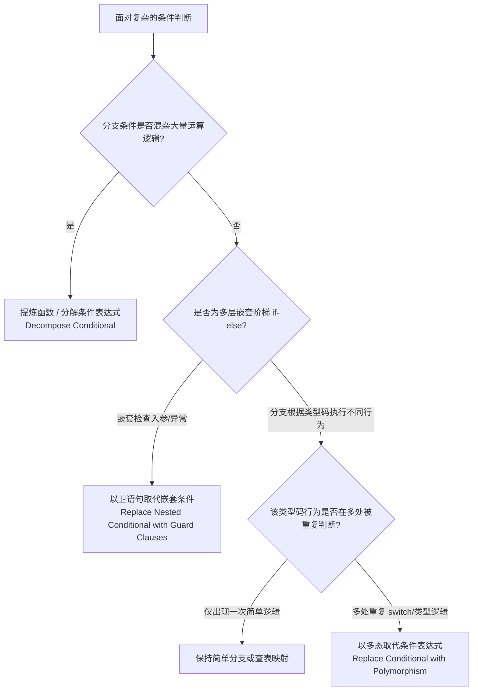

# 高频核心重构手法与实战决策树 (Core Refactorings)

> 汇集 Martin Fowler《重构》中出现频次最高、收益最显著的实战重构技法与详细步骤指南。

---

## 1. 核心概念与定义

- **重构手法（Refactoring Technique）**：  
  经过验证、保证行为不变性的一套**原子化代码转换步骤**。每一个手法都包含：动机、实施机制（Mechanics）与验证依据。
- **高频重构四大领域**：
  1. **组织函数与变量（Organizing Functions & Variables）**：划清函数的意图边界，消灭临时状态与魔法值。
  2. **简化条件逻辑（Simplifying Conditional Logic）**：降解圈复杂度（Cyclomatic Complexity），消除嵌套。
  3. **重构循环与集合（Refactoring Loops & Collections）**：以声明式管道取代命令式状态累加。
  4. **搬移特性与职责（Moving Features）**：确保数据与处理该数据的行为紧密贴合。

---

## 2. 核心重构手法决策树与机制 (Decision Tree)

### (1) 条件分支重构决策树



### (2) 高频核心重构手法速查

| 重构手法 | 核心动机 | 标准实施步骤 (Mechanics) | 验收标志 |
| :--- | :--- | :--- | :--- |
| **提炼函数 (Extract Function)** | 一段代码的目的与实现细节混合，无法一眼看懂意图 | 1. 识别代码片段边界与局部入参/返回值；<br/>2. 新建具名函数（以**“做什么”而非“怎么做”**命名）；<br/>3. 复制逻辑并替换原位置为函数调用；<br/>4. 跑测试。 | 原函数体缩短至具名意图级别，无多余局部临时变量泄露 |
| **以卫语句取代嵌套条件 (Guard Clauses)** | 嵌套 if-else 层层缩进，正常主干逻辑被埋在最深层 | 1. 提取所有异常检查与边界退出分支；<br/>2. 满足条件即刻 `return` 或抛出异常；<br/>3. 消除多余的 `else` 关键字，让主干平铺直叙。 | 代码缩进不超过 1~2 层，主流程在最外层自顶向下单向流动 |
| **以管道取代循环 (Replace Loop with Pipeline)** | 传统的 `for/while` 循环混杂了过滤、累加、状态游标与多重分支 | 1. 用现代集合操作（`filter`、`map`、`reduce`、`flatMap`）拆解循环；<br/>2. 去除累加器临时变量。 | 消除遍历中的可变状态变量，阅读时清晰呈现数据变换流水线 |
| **以查询取代临时变量 (Replace Temp with Query)** | 复杂的局部变量被多次重复赋值或向下层传递，导致函数难以提炼 | 1. 检查临时变量是否为只读或可纯函数计算；<br/>2. 将计算表达式提取为独立的查询方法/Getter；<br/>3. 替换临时变量引用为查询方法调用。 | 局部临时变量减少，目标代码块具备被独立提炼的前提 |
| **引入参数对象 (Introduce Parameter Object)** | 函数参数经常一起出现（如经纬度、起止时间、价格与币种） | 1. 声明新的数据结构/类将这组参数打包；<br/>2. 修改函数签名接收该对象；<br/>3. 将针对这些参数的通用校验沉淀入新类的方法中。 | 参数减少到 1~2 个，新对象演进为具备行为的领域值对象 |
| **以多态取代条件表达式 (Replace Conditional with Polymorphism)** | 多处方法内充斥着针对同一 `type` 的 `switch` 分支 | 1. 创建继承基类或接口；<br/>2. 为每个 switch 分支建立子类或策略实现类；<br/>3. 将分支内部的具体逻辑搬移到各子类覆写方法中。 | 主流程消灭 switch/case，新增类型只需添加新子类而无需修改原类 |

---

## 3. 反模式与坏味道 (Anti-patterns)

- **以多态之名行过度抽象（Polymorphism Obsession）**：  
  *错误做法*：只要看到一个只有两个分支且永远不会扩展的 `if-else`，就非要搞抽象工厂 + 策略模式 + 4 个子类。  
  *危害后果*：代码急剧碎片化，简单的一目了然逻辑被分散在 5 个文件中，违反 KISS 和 YAGNI。
- **以查询取代临时变量导致性能暗坑（Query Call Amplification）**：  
  *错误做法*：在没有缓存的情况下，把一个涉及耗时数据库 I/O 或高密集 CPU 计算的临时变量直接换成方法调用，且在循环中调用 100 次。  
  *危害后果*：虽然代码形态整洁，但导致了严重隐藏的 N+1 查询与 CPU 暴涨。
- **卫语句滥用破坏后置资源释放（Leaky Guard Clauses）**：  
  *错误做法*：在已经打开锁、数据库事务或文件流之后直接用卫语句 `return`，未执行 `finally` 或资源回收。  
  *危害后果*：导致连接泄露、死锁或未提交脏事务。

---

## 4. Do & Don't 对比

### 案例 1：深层嵌套 vs 卫语句平铺 (Guard Clauses)

- ❌ **Don't（多层嵌套 if-else，主逻辑深陷其中）**：
  ```javascript
  function getPayAmount(employee) {
    let result;
    if (!employee.isSeparated) {
      if (!employee.isRetired) {
        if (employee.hasInsurance) {
          result = calculateNormalWithInsurance(employee);
        } else {
          result = calculateNormalPay(employee);
        }
      } else {
        result = retiredAmount();
      }
    } else {
      result = separatedAmount();
    }
    return result;
  }
  ```
- ✅ **Do（卫语句提前退出，清晰呈现边缘检查与主路径）**：
  ```javascript
  function getPayAmount(employee) {
    if (employee.isSeparated) return separatedAmount();
    if (employee.isRetired) return retiredAmount();
    
    // 主干业务逻辑直接在平层展开
    if (employee.hasInsurance) {
      return calculateNormalWithInsurance(employee);
    }
    return calculateNormalPay(employee);
  }
  ```

### 案例 2：命令式状态循环 vs 声明式数据管道 (Pipelines)

- ❌ **Don't（繁琐的多重状态累加与遍历，容易越界或产生分支疏漏）**：
  ```javascript
  function acquireActiveUserNames(users) {
    const names = [];
    for (let i = 0; i < users.length; i++) {
      const u = users[i];
      if (u.status === 'ACTIVE') {
        if (u.profile && u.profile.role === 'ADMIN') {
          names.push(u.name.trim().toUpperCase());
        }
      }
    }
    return names;
  }
  ```
- ✅ **Do（以声明式函数管道替代，意图自解释且无副作用状态）**：
  ```javascript
  function acquireActiveUserNames(users) {
    return users
      .filter(u => u.status === 'ACTIVE')
      .filter(u => u.profile?.role === 'ADMIN')
      .map(u => u.name.trim().toUpperCase());
  }
  ```

### 案例 3：重复条件切换 vs 多态/策略对象

- ❌ **Don't（到处重复 switch 检查类型码）**：
  ```javascript
  class OrderCalculator {
    calculateDiscount(order) {
      switch (order.customerType) {
        case 'REGULAR': return 0;
        case 'VIP': return order.amount * 0.1;
        case 'SUPER_VIP': return order.amount * 0.2;
      }
    }
    calculatePoints(order) {
      switch (order.customerType) {
        case 'REGULAR': return order.amount;
        case 'VIP': return order.amount * 2;
        case 'SUPER_VIP': return order.amount * 3;
      }
    }
  }
  ```
- ✅ **Do（利用策略对象/多态封装行为，开闭原则）**：
  ```javascript
  const CustomerDiscountStrategies = {
    REGULAR: { discount: (amt) => 0, points: (amt) => amt },
    VIP: { discount: (amt) => amt * 0.1, points: (amt) => amt * 2 },
    SUPER_VIP: { discount: (amt) => amt * 0.2, points: (amt) => amt * 3 },
  };

  class OrderCalculator {
    getStrategy(type) {
      return CustomerDiscountStrategies[type] || CustomerDiscountStrategies.REGULAR;
    }
    calculateDiscount(order) {
      return this.getStrategy(order.customerType).discount(order.amount);
    }
    calculatePoints(order) {
      return this.getStrategy(order.customerType).points(order.amount);
    }
  }
  ```
